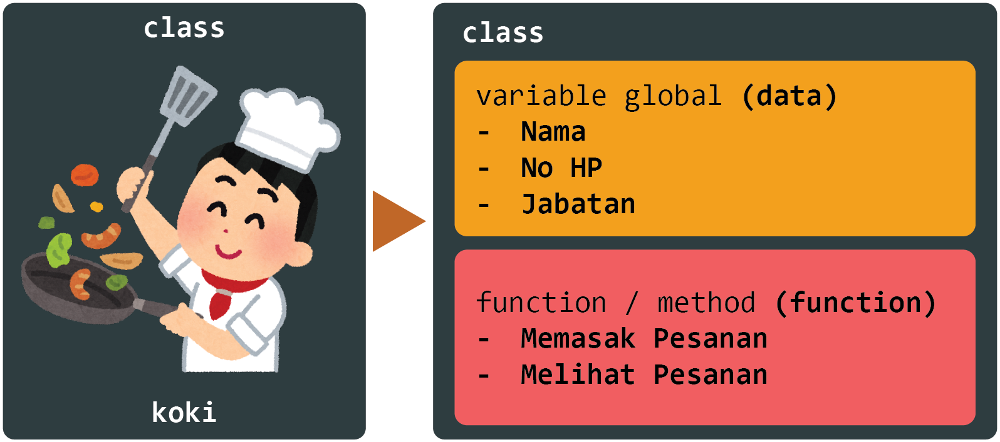
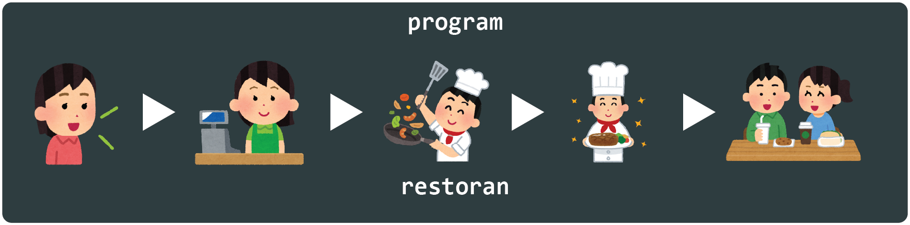
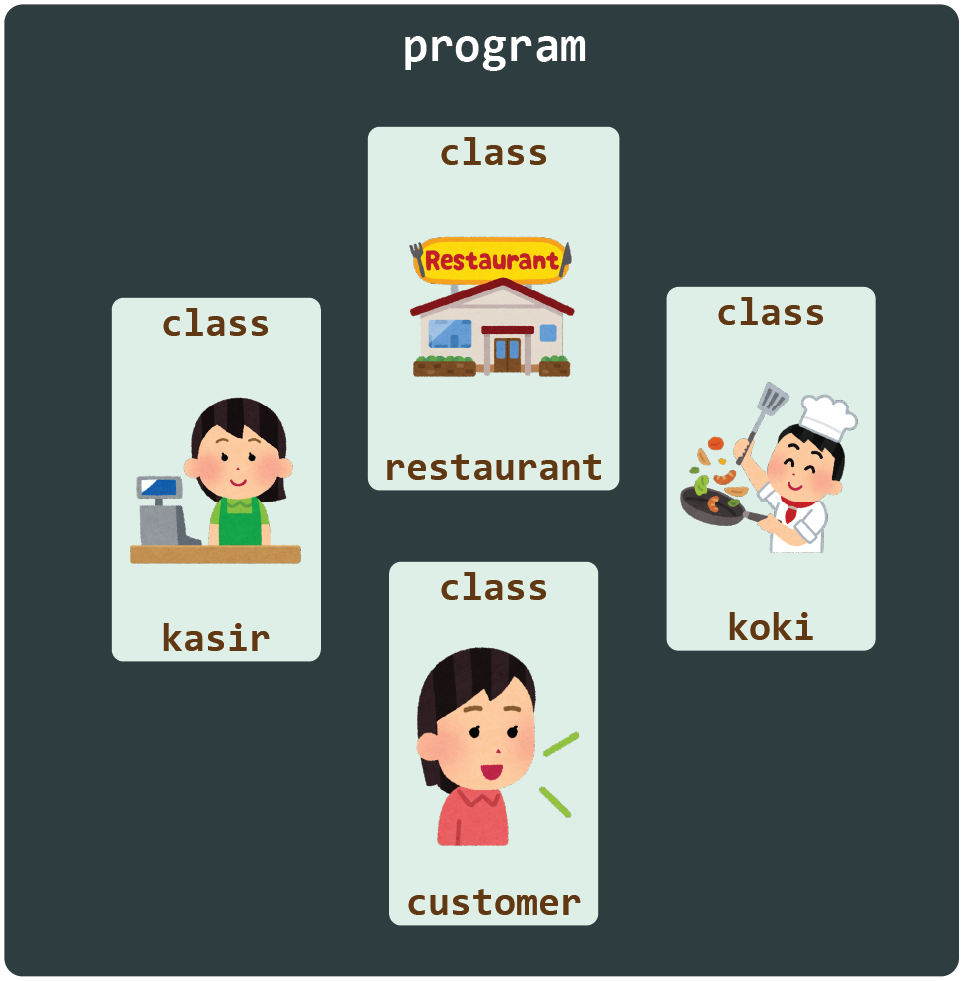

## Pendekatan Desain dan Program Berorientasi Objek

### Pembukaan

Pemrograman Berorientasi Objek ***(Object Oriented Programming)*** seperti terdeskripsikan pada namanya merupakan metode pemrograman yang menggunakan objek. 
Pemrograman Berorientasi Objek bertujuan untuk menyatukan kedalam suatu **class**, data dan fungsi yang beroperasi pada konteks class tersebut

### Kelebihan

Pendekatan Desain dan Program Berorientasi Objek memiliki kelebihan diantaranya :

1. **Tidak terjadi perulangan** pembuatan fungsi yang sama pada code / Keep Java code DRY (Don’t Repeat Yourself) 
Karena setiap operasi / tipe data terpisah dan di wakilkan oleh class, maka tidak code / program dibuat berulang.

2. Program lebih **terstruktur secara rapi**
Karena setiap operasi terpisah yang diwakili oleh class, maka tidak ada operasi-operasi yang tercampur.

2. Cepat dan Mudah untuk di eksekusi (dari sisi compile program)
Tidak adanya 

Serangkaian Code yang memiliki fungsi yang sama disatukan dan dipisahkan sebagai fungsi

Memudahkan Code untuk dikelola, dimodifikasi, dan didebug
Memungkinkan untuk code yang dibuat untuk sebuah program dapat digunakan untuk program yang lainnya tanpa harus membuat code baru.

!!! question "Pertanyaan"
    Berikan Contoh Lain dari kelebihan pengaplikasian Pemrograman Berorientasi Objek pada program yang kita buat.

## Konsep 

<figure markdown>
  { width="600" }
  <figcaption>Struktur Class</figcaption>
</figure>

Seperti di jelaskan pada pembukaan, Pemrograman Berorientasi Objek di applikasikan pada 

Untuk memudahkan kita untuk mengerti tentang konsep dari Pemrograman Berorientasi Objek, 

<figure markdown>
  { width="600" }
  <figcaption>Pendekatan Pemrogramman Sequensial</figcaption>
</figure>

<figure markdown>
  { width="600" }
  <figcaption>Pendekatan Pemrogramman Berorientasi Objek</figcaption>
</figure>

### Class

### Objek
Merupakan sebuah unit dasar dari Pemrograman Berorientasi Objek dan merepresentasikan entitas dunia nyata (real life entity). Sebuah objek adalah 

### Data Abstraction

### Inheritance

**Inheritance** Merupakan teknik mewariskan **fungsi/method** yang ada di **satu class** ke **class lainnya**. Pada Inheritance terdiri dari 2 Kateogri.
1.  ** Sub Class (Child) **

### Polymorphism

### Encapsulation

### Abstraction

### Latihan

Diberikan 