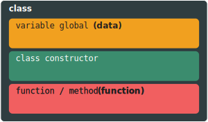

**Oleh: Bassamtiano**

Slide : 

Pada bagian ini akan dipelajari bagaimana pengimplementasian dasar konsep pemrograman berorientasi objek. Pada bagian ini kita akan mempelajari pembuatan dan penggunaan class. serta 

## **Pembukaan**

Pada Pendekatan Pemrograman Berbasis Objek, Line Program di bagi bagi menjadi.
Pendekatan Pemrograman Berorientasi Objek memiliki target untuk mengimplementasikan objek 


## **Class**

Class adalah sebuah tipe data yang di definsikan oleh User (programmer) memiliki 2 elemen yaitu data dan function. 
Kedua elemen tersebut dapat di akses dan digunaan dengan membuat permintaan pada Class tersebut.
Class merepresentasikan sebuah kumpulan {==Test==} property dan atau methods / function (metode) untuk merepresentasikan sebuah tipe objek yang memiliki properti / identitas yang semuanya sama.


<figure markdown>
  { width="500" }
  <figcaption>Struktur Class</figcaption>
</figure>


Contoh : Semisal terdapat sebuah Class dari Kendaraan. Pada kendaraan terdapat berbagai merek dan nama yang berbeda, namun semuanya memiliki kesamaan properti yang sama. Seperti contohnya jumlah roda, warna, jumlah pintu, kecepatan maksimum, tipe transmisi, dan sebagainya. Disini, Kendaraan adalah class dan jumlah roda, warna, jumlah pintu, kecepatan maksimum adalah properti nya.

Dapat di simpulkan class seperti sebuah blueprint / kerangka untuk sebuah objek.

=== "Java"

    ``` java hl_lines="3-4" linenums="1" 
    package com.pbo.myproject;

    class MyClass {
        
    }

    ```
=== "Kotlin"
    class MyClass {
    }


=== "C#"

    ``` csharp linenums="1" hl_lines="4-5"
    using System;

    namespace myproject {
        class MyClass {
        }
    }

    ```

=== "C++"
    ``` cpp linenums="1" hl_lines="1-2"
    Class MyClass {
    }

    ```

=== "Visual Basic"

    ``` vbnet linenums="1" hl_lines="1-3"
    Module MyClass

    End Module
    ```

=== "Python" 

    ``` py linenums="1" hl_lines="1-2"
    class MyClass:

    ```


## **Data / Variable Global**

Data / Variable Global merupakan variable yang dapat di akses method di dalam class. 
Seperti di jelaskan bahwa class memiliki bagian 

=== "Java"

    ``` java hl_lines="4-6" linenums="1" 
    package com.pbo.myproject;

    class MyClass {
        Int
    }

    ```
=== "C#"

    ``` csharp
    using System;

    namespace myproject {
        class MyClass {
            static void main(String[] args) {
                Console.WriteLine("Hello World!")
            }    
        }
    }

    ```

=== "Visual Basic"

    ``` vbnet
    Module MyClass
        Sub Main(args As String())
            Console.WriteLine("Hello World!")
        End Sub
    End Module

    ```

=== "Python"

    ``` py
    class MyClass:
        def main(self):
            print("Hello World!")
    

    if __name__ == '__main__':
        MyClass.main()

    ```


## **Function / Method**

Function merupakan bagian dari class dimana 

=== "Java"

    ``` java hl_lines="4-6" linenums="1" 
    package com.pbo.myproject;

    class MyClass {
        public static void main(String[] args) {
            System.out.println("Hello World!")
        }
    }

    ```
=== "C#"

    ``` csharp
    using System;

    namespace myproject {
        class MyClass {
            static void main(String[] args) {
                Console.WriteLine("Hello World!")
            }    
        }
    }

    ```

=== "Visual Basic"

    ``` vbnet
    Module MyClass
        Sub Main(args As String())
            Console.WriteLine("Hello World!")
        End Sub
    End Module

    ```

=== "Python"

    ``` py
    class MyClass:
        def main(self):
            print("Hello World!")
    

    if __name__ == '__main__':
        MyClass.main()

    ```
   
!!! info

    Python merupakan bahasa pemrograman yang mengharuskan identasi / posisi setiap baris sesuai dengan levelnya


## Class Constructor

Constructor merupakan method yang **pertama kali di eksekusi** saat class di deklarasikan. 

## Parameters

=== "Java"

    ``` java hl_lines="4-6" linenums="1" 
    package com.pbo.myproject;

    class MyClass {
        public static void main(String[] args) {
            System.out.println("Hello World!")
        }

        public void hitung(int harga_satuan, int jumlah_beli) {
            int total_harga = harga_satuan * jumlah_beli
            System.out.println(total_harga)
        }
    }

    ```
=== "C#"

    ``` csharp
    using System;

    namespace myproject {
        class MyClass {
            static void main(String[] args) {
                Console.WriteLine("Hello World!")
            }    

            public void hitung(int harga_satuan, int jumlah_beli) {
                int total_harga = harga_satuan * total_beli
                Console.WriteLine(total_harga)
            }
        }
    }

    ```

=== "Visual Basic"

    ``` vbnet
    Module MyClass
        Sub Main(args As String())
            Console.WriteLine("Hello World!")
        End Sub

        Sub Hitung(Dim harga_satuan, Dim jumlah_beli)
            Dim total_harga = harga_satuan * total_beli
            Console.WriteLine(total_harga)
        End Sub

    End Module

    ```

=== "Python"

    ``` py
    class MyClass :
        def main(self):
            print("Hello World!")

        def hitung(self, harga_satuan, jumlah_beli):
            total_harga = harga_satuan * jumlah_beli
            print(total_harga)
    
    if __name__ == '__main__':
        MyClass.main()

    ```

## Return Type
aa

## Komunikasi antar Method
aa

## Variables

Variable merupakan bagian dari method yang merepresentasikan suatu nilai. Nilai-nilai tersebut memiliki tipe data. Setiap tipe data memiliki kegunaan yang berbeda.


## Latihan


